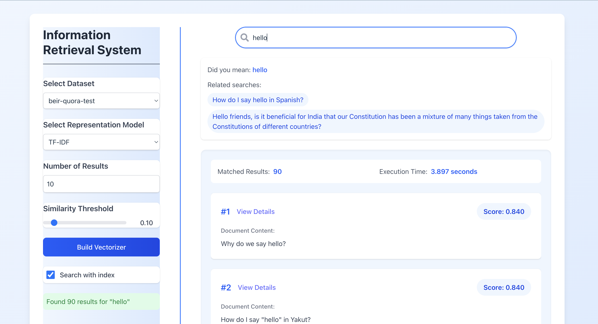

# 🔍 Information Retrieval System

## 📘 Overview  
The **Information Retrieval System** is an end-to-end full-stack application designed to efficiently retrieve and rank relevant documents from large text datasets.  
Built with **FastAPI** and **React**, the system combines **traditional IR models** and **modern semantic search techniques** to provide intelligent, fast, and accurate search results for natural language queries.

---

## ⚙️ Architecture  
The project follows a **Service-Oriented Architecture (SOA)** with a modular and scalable design:
- **Backend:** FastAPI service for indexing, retrieval, and NLP processing  
- **Frontend:** React web interface for real-time search and results visualization  
- **Database:** MongoDB for document storage and indexing  
- **Communication:** RESTful API integration between frontend and backend  

---

## 🧮 Core Algorithms  
The retrieval engine integrates multiple ranking models and hybrid strategies:

| Model | Description |
|--------|--------------|
| **TF-IDF** | Classic vector space model ranking based on term importance |
| **BM25 (Okapi)** | Advanced lexical ranking optimized for relevance |
| **BERT / Sentence-BERT** | Semantic embeddings for contextual similarity |
| **Hybrid Model** | Combines lexical and semantic results for improved accuracy |

---

## 🧠 Natural Language Processing  
The system incorporates multiple NLP components for intelligent query understanding:
- Tokenization, stopword removal, and lemmatization  
- **Query expansion** using synonyms and related terms  
- **Spelling correction** via contextual error detection  
- Document clustering for organized and topic-aware results  

---

## 🚀 Key Features  
- Multi-dataset support with standardized evaluation pipelines  
- Query refinement and real-time spelling correction  
- Interactive search UI built with React + TailwindCSS  
- Document clustering and semantic grouping  
- RESTful API for programmatic access to IR functions  
- Caching and indexing optimization for large-scale datasets  

---

## 🧪 Evaluation & Results  
Evaluated using industry-standard IR metrics on benchmark datasets (e.g., BEIR-Quora):

| Metric | Score |
|---------|-------|
| **Mean Average Precision (MAP)** | 70.1% |
| **Mean Reciprocal Rank (MRR)** | 74.2% |
| **Precision@k / Recall@k** | Consistently high across datasets |

Demonstrates balanced performance between **lexical precision** and **semantic understanding**.

---

## 🧰 Technologies  
**Backend:** Python, FastAPI, MongoDB, NumPy, scikit-learn  
**Frontend:** React, TypeScript, TailwindCSS  
**NLP & ML:** NLTK, Sentence-BERT, PySpellChecker  
**Evaluation:** MAP, MRR, Precision@k, Recall  

---

## 📸 Screenshots

*Figure 1: Interactive search interface with query refinement and clustering results.*


---
## 🏗️ Installation & Setup  

### Backend
```bash
git clone https://github.com/yourusername/IR-project.git
cd IR-project
python -m venv ir_venv  
source ir_venv/bin/activate # (On Windows: ir_venv\Scripts\activate)
pip install -r requirements.txt
uvicorn app.main:app --reload
```

### Frontend
```bash
cd frontend
npm install
npm run dev
```

Then open your browser at **http://localhost:5173** (or as printed in terminal).

---

## 📊 Skills Demonstrated  
- Information Retrieval & Search Engine Design  
- NLP Pipelines and Text Preprocessing  
- Model Evaluation & Ranking Metrics  
- Full-Stack Development (FastAPI + React)  
- Service-Oriented Architecture (SOA)  
- Performance Optimization and Scalability  

---

## 📈 Future Enhancements  
- Integration of **RAG (Retrieval-Augmented Generation)** using LLMs  
- Advanced query intent classification  
- Cross-lingual retrieval and multilingual embeddings  
- Web-based analytics dashboard for search insights  
